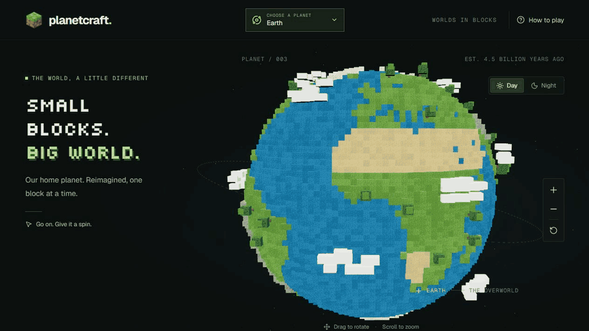

# Planetcraft

Explore a universe of blocks, inspired by Minecraft.

Choose a planet and start exploring. Earth, Mars, and Saturn are ready: give them a spin, discover their features, and switch between day and night. Mars adds red dunes, craters, volcanic highlands, canyons, polar ice caps, and optional dust haze. Its terrain is a playful interpretation, not a geographic map.

Saturn adds golden cloud bands, storm lanes, polar haze, a north-pole hexagon, and icy voxel rings with a visible Cassini division. Toggle the rings or pick a feature to take a closer look. Its clouds and rings are a playful interpretation of a gas giant, not a solid surface.

The other planets are still waiting for their first blocks.

[Explore Planetcraft](https://benziza.github.io/planetcraft/)

To preview locally, run `npm ci` and `npm run dev`, then open `http://localhost:3000/#/saturn`.
